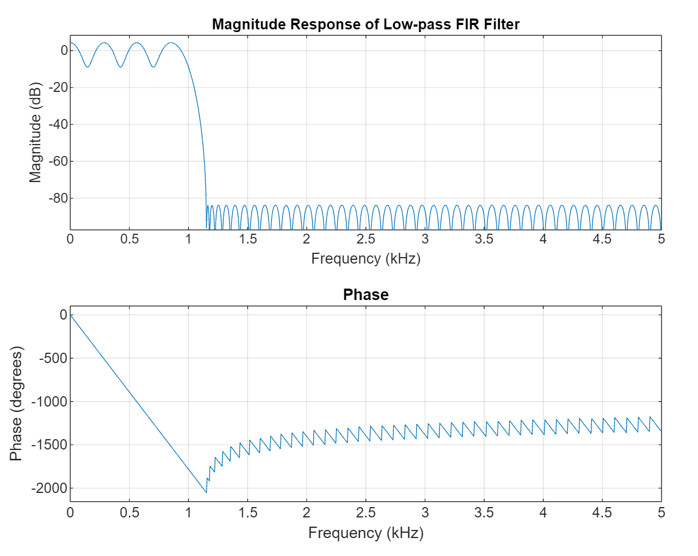
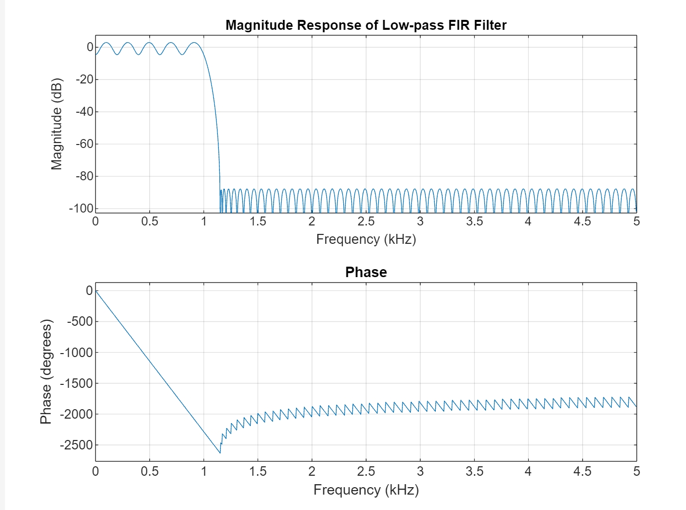
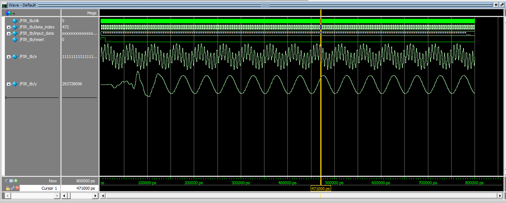

# FIR filter Design
## Design the Parameters
- Parameters could be designed through matlab by applying ```firpminit``` in filter. This function could be used as ```b = firpm(n,ff,aa,w)```in which, adjust ```ff``` could adjust the passband, adjust the ```w``` could adjust the ripple and stopband attenuation. The return is the coefficient of the FIR filter.
- Hence apply this function to generate the coefficient for the 100-tap FIR filter.
- The magnitude-frenquancy response for this filter at $f_s=10kHz$is shown below
  
- The stopband attenuation is a little bit lower than 80dB and in consideration of parallelize convenience, increase the tap number to 128.
- The matlab designed magnitude-frequency response is as follows
  
- Finally the stopband attenuation 80.3579 dB, and passband ripple is 4.9411 dB
- Get the b coefficients in ```b.txt``` file.
## Hardware design
- After get ```b```, the FIR filter could be directly designed by systemverilog
1. First, implement a non-pipelined normal FIR filter, There are two part in the code, one is the delay and the other is accumulation.
The details could be seen source code 
  - The block figure is as shown below
  - The simulation wave is shown below
  
2. Next implement the piplined version. 
  - As discussed by []citation, ...
  - The piplined simulation wave is shown as below 
  
