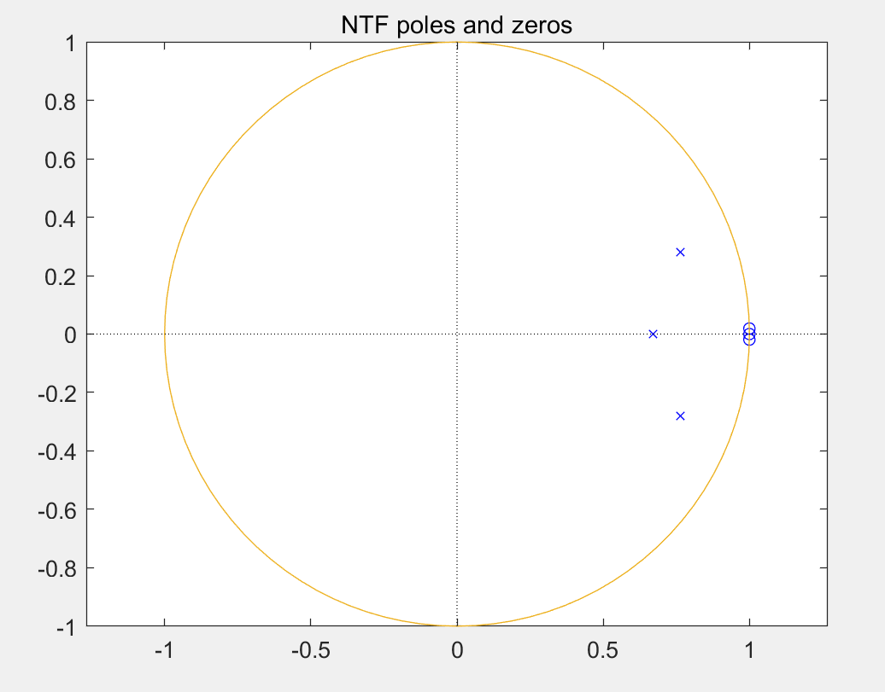
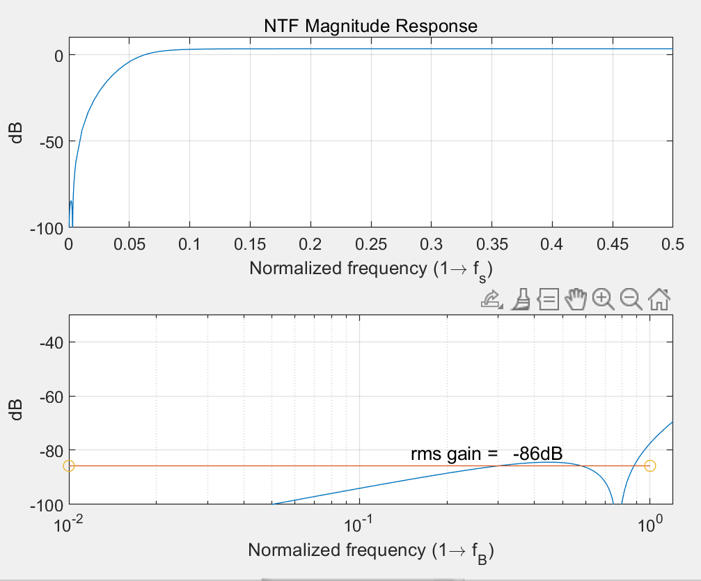
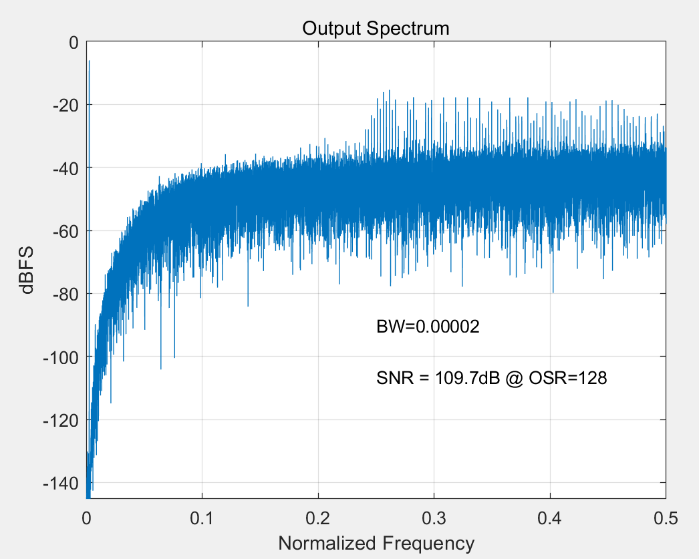
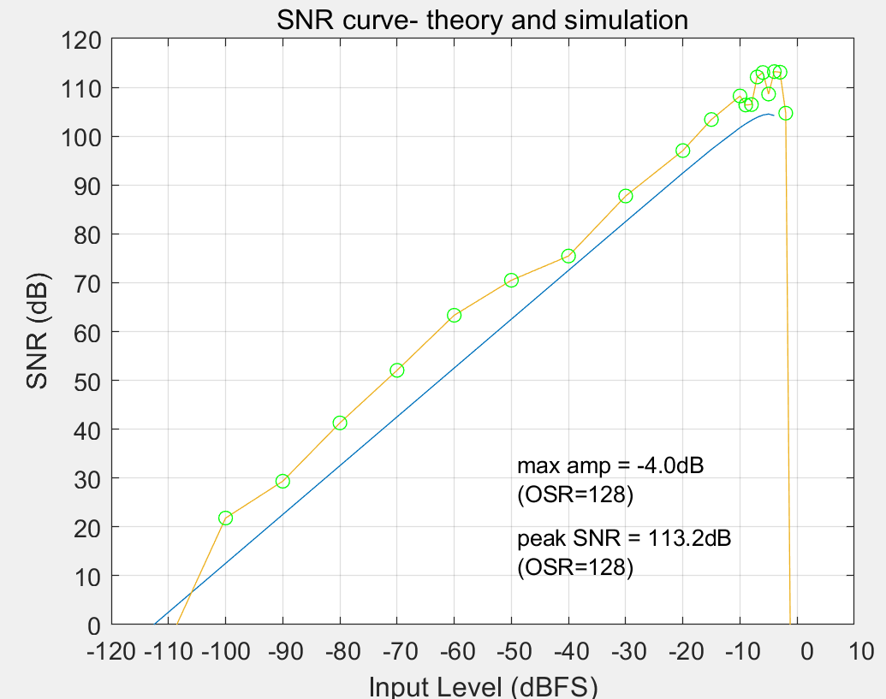

# A Double channel Sigma-Delta DAC Module
## Overview
The design is a double channel 3 order, 4bit quantization Sigma-delta noise modulator and dynamic elements matching module.
- Matlab design for basic block parameters
- Implement with verilog and simulation.
- Synthesis by synopsys for power and area information.
- Place and route in Cadence innovus.

## Structure design

### Block view

### Design workflow
- Use Matlab Delta Sigma Toolbox to analyse the modulator
- ```synthesizeNTF``` is a useful tool to directly get the poles and zeros for the noise transfer function 


-```simulateDSM``` is a useful tool for peek magnitude and signal noise ratio. (Passband=20000Hz, OSR=128, Fs=48000Hz)
-```[a,g,b,c]=realizeNTF(H)``` could help to get the parameters for CRFB(Cascade-of-resonators, feedback form) modulator as shown in block view.





 （3）使用simulateDSM函数得到最大输入幅度和最大信噪比
	
	信噪比会随输入幅度的增大而增大，但会在某一点发生溢出，截断信号，因此，可以
利用[snr,amp] = simulateSNR(H,R);找到最大SNR出现的点，确定最大输入幅度，避免截断。找到最大信噪比：113.2dB和最大信号输入幅度：-4dB

（3）确定调制器结构参数
	利用[a,g,b,c]=realizeNTF(H)函数，得到一个CRFB前馈振荡器级联形式类型的调制器的结构，其中，a,g,b,c分别代表的图中a,b,g,c系数矩阵的值
	通过ABCD=stuffABCD(a,g,b,c)可以得到调制器的状态空间，表征了调制器的各项参数。然后使用[ABCDs,umax] = scaleABCD(ABCD,[],[],[],[],[],1e4)对调制器的状态空间进行限制。
	最后用[as,gs,bs,cs] = mapABCD(ABCDs)重新计算求得调制器的a,g,b,s系数的最终可实现值。

根据上图所示的关系可以得到如下的关系：
对于1/(Z-1) 存在差分方程：y(n)=y(n-1)+x(n-1)
对于Z/(Z-1) 存在差分方程：y(n)=y(n-1)+x(n)
然后结合 a b g c 带入图中，得到：
    x3(n)=x3(n)+x2(n)*c2+u(n)*b3-a3*v(n);
    x2(n)=x2(n)+x1(n)*c(1)+x(n)*b2-a2*y(n)-g1*x3(n);
    x1(n)=x1(n)+b(1)*x(n)-a(1)*v(n);
    y(n)=x(n)*b4+x3(n);

2.3. Matlab仿真
	在实验中，输入一个正弦信号对生成模块进行功能仿真，其性质如下：
 	频率：1kHz
	输入增益：-4dB
	采样频率：19kHz
	过采样率：128
    电容的失配率：0.1%~1%
仿真计算信噪比得到如下的结果：


	其中，Mismatch_scale代表电容失配率，snr_dsm和snr_dsm_40k分别代表在没有电容失配的情况下的20k和40k带宽的信噪比。snr_dac和snr_dac_40k分别代表在有电容失配且有DEM的情况下的20k和40k带宽的信噪比。snr_dac_th和snr_dac_th_40k分别代表在有电容失配且无DEM的情况下的20k和40k带宽的信噪比。input_dB代表输入的幅值
	下面四幅图依次是有DEM的输出信号频域仿真图，有DEM的信号在fs/2内的频率的频域图，无DEM有电容失配的输出信号频域图，无电容失配的输出信号频域图。


3. Verilog Design 
	The module is divided in to four layers：adders, dsm, dem, too
3.1. adders.v
共有三个加法器，分别是一个1bit全加器，一个1bit半加器，一个28bit全加器。

3.2. dsm_top.v
这个调制器结构需要三个积分器，一个反馈结构，一个量化器，feedback模块，三个积分器首位相连，又分别与feedback连接，最终结果从量化器输出。

3.3. dem_top.v
Sigma_delta的动态元件匹配 (DEM) 结构总共4级，每一级设计一个function即可。

3.4. dsm_dem_top.v

连接dsm_top和dem_top模块，进行例化，


3.5. 仿真结果


结果通过testbench.v输出到data文件中，经过与matlab的结果对比（信噪比等参数），行为仿真的输出基本符合预期。

4. 使用Genus进行综合
行为仿真后，进行综合。下面是具体步骤：
4.1. Setting Up

进行基本搜索路径，time library，和HDL文件读取后，进行elaboration，并查看schematic，schematic如下：

4.2. Constraint Analysis
设定如下：

时钟周期为40ns, input delay为4ns, output delay为8ns, load capacitance为1fF, driving cell为INVX12, 查看time intent, 没有问题：

没有明显问题。

4.3. Run Synthesis
运行后查看schematic，结构和各端口基本正常：

4.4. Static Timing Analysis
查看static timing analyse的结果：

没有 negative slack且require time和slack基本正常，此器件可以在25MHz下工作。结果存在/design_files/Time/genus_static_time_analysis_report.tarpt中。
写好文件，进行下一步


5. Place-and-Route with Innovus
5.1. Setup
编写io assignment file，mmmc_setup.tcl，并初始化


对IO Pin的距离进行调整。
5.2. Floorplan
进行Floorplan规划版图的大概基础
设定aspect ratio为1，目标为0.7，且引脚和电路的距离设为16um。
设定VDD和VSS
绘制电源环，以及交叉的电源线：

让电源环在M6和M7层上，纵向在M6，横向在M7


运行检查后，Connectivity和Geometry都没有问题

5.3. 器件放置和时钟树预设计
先确认045工艺

进行初始的标准器件和预放置器件的优化，提高逻辑结构，降低拥挤，减小面积，优化时序。
结果如下：


各模块的布局设计如下：

初始的时钟树如下：


查看时序设计的结果：


从输出的文件内容看，没有negative slack，因此此器件可以在25MHz下正常工作。

5.4. Clock Tree Synthesis 
运行CTS，并查看结果，结果中，所有slack均为正数，因此该器件在该时钟下可以正常工作。结果保存在/design_files/Time/clock_tree_analysis.tarpt中


5.5. Detail Routing
运行CTS后，没有发现有错误，因此运行这一步，在不降低时序或产生违反信号完整性的情况下对设计进行布线。运行结果如下：


结果可以从Timing Debug中查看，没有negative slack且无错误。

Timing的结果保存在/design_files./Timing/time_analysis_after_nano_routine.tarpt中
5.6. 完成芯片设计
添加填充单元。填充单元基本上是空的标准单元，连接每个标准单元行中的阱。
.进行DRC和Connectivity验证 


最终的设计截图如下：


最后，提取网表和def文件，提取后的文件保存在 /design_files/result/dsm_dem_par.v和/design_files/result/dsm_dem.def 中
6. 结果验证
6.1. Import Schematic 和 Layout 
在virtuoso的library中添加dsm_dem library，并添加dsm_dem cell，并添加
/design_files/result/dsm_dem_par.v和/design_files/result/dsm_dem.def。


6.2. 进行DRC验证
DRC验证没有问题


6.3. 进行Extracted
Extracted 成功，无问题


6.4. 进行LVS验证
net-list 匹配，文件保存在/design_files/result/lvs.out


6.5. 提取gds
gds文件存储在/design_files/result/dsm_dem_top.gds中