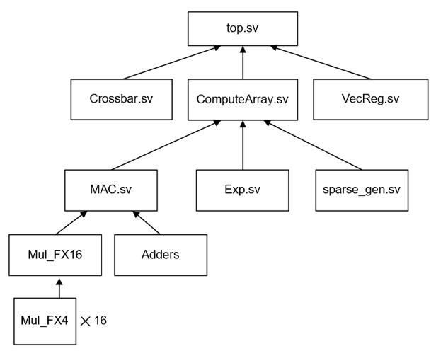

# A Vector-Array Hybrid Process Core
This design is a processor core for sparse matrix multiplication which could execute both SDDMM (Sampled dense-dense matrix product) and SpMM (Sparse Matrix-Matrix multiplication). 
## Hardware Design
### Overview
- This core is designed based on the most commen architectute used in nowadays DSM which is has both spatially parallelism and temporally parallelism.
- The design of the array is shown as below
- Vector Array is designed based on several processing elements with multiple function units
- Diverse dataflow is designed based on multiple MUX and connected to data bus with each PE.

### SDDMM and SpMM
- As discussed in [SPADE](https://dl.acm.org/doi/10.1145/3579371.3589054), there are two typical matrix multiplication in ML.
- SDDMM (Sampled dense-dense matrix product)  should be supported for sparse output matrix
- SpMM (Sparse Matrix-Matrix multiplication) should be supported for sparse operands.
- We implement two different dataflow for the two different sparse pattern


### Mix-precision Multiplication
- The processor support two types of quantization: FX4 and FX16
- The multiplication of FX16 could be implemented by FX4 multipliers
    - Take FX2 and FX4 in examples:
$$a\times b = a_{LSB}\times b_{LSB}<< 4 + a_{LSB}\times b_{MSB}<< 2+ a_{MSB}\times b_{LSB}<< 2 + a_{MSB}\times b_{MSB}$$


### Softmax Approximation
- Algorithm: Use only shifter and adders to implement it.
    - Softmax + max normalization: $\sigma(z_i) = \frac{e^{z_i-z_{max}}}{\Sigma_{j=1}^Ne^{z_j-z_{max}}}$, let $z_i-z_{max}=y_i$
    - The denominator can be approximated to the nearest power-of-two integer value.
    - The $e^{y_i}$ can be approximated by $2^{1.5y_i}$ and $1.5y_i=(y_i+y_i/2)$ which means $y_i+y_i>>1$
    - Represent $2^{1.5y_i}$ by $2^{u_i+v_i}$ where $u_i$ and $v_i$ are integer and fractional part of $1.5y_i$ respectively.
    - for $v_i$ is in $[-1,0]$, $2^{v_i}$ can be approximated by $1+v_i/2$ which means $1+v_i>>1$, and $2^{u_i}$ is $>>abs(u_i)$
    - $\frac{(1+v_i>>1)>>abs(u_i)}{round(\Sigma_{j=1}^N (1+v_j>>1)>>abs(u_j))}$

## HDL implementation
- The organization of code is shown below 

  - MAC is designed by 4 bit multipliers and adders
  - Exponent is designed by shifter and adders
  - sparse_gen contains comparators
  - crossbar contains 128/64/32/16 multiplexers

## Simulation and Synthesis
### Simulation Results
- Mac_array

- Exponential component

- Sparse_gen

- Vecreg

- Top


### Synthesis details
- The execution components are synthesised by synopsys with FreePDK 45nm
- The memory and local buffer is evaulated by CACTI 7.0.
- Report from synopsys and cacti are in folder ```./reports```

| Component         | Configuration                   | Static Power (mW)   | Dynamic power/energy     | Area(mm $\times$ mm) |
|-------------------|---------------------------------|---------------------|--------------------------|--------------------|
| SRAM              |  512KB                          | 896.709             | 0.19nJ/read; 0.17nJ/write|   2.3387    |
|  Vector Registers | $32\times 64 \times 4B$ attention|       44.86        | 0.02nJ/read; 0.02nJ/write| 0.2754      |
|  Vector Registers | $32\times 64\times 4B$ query    |         44.86       | 0.02nJ/read; 0.02nJ/write|  0.2754     |
|  Vector Registers | $32\times 64\times 4B$ key      |      44.86          | 0.02nJ/read; 0.02nJ/write|  0.2754     |
|  PE Array         | $32\times 8 \times 4$ MACs      | 44.13               |    13.45W                |  9.997312   | 
|   Crossbar        | $32\times 32$ Multiplexer       | 11.76               |       2.260W             |    0.1605   |
|     Others        | $32\times 32$  Adders in tree   |              1.33   |        0.512W            |  0.291,840  |
|        Others     | $32\times 32$ Shifter           |         10.19       |  4.587W                  |      2.5497 |
|     Others        | $32\times 128$ Comparator       |         0.73728     |     0.30W                | 0.2805      |
                            
